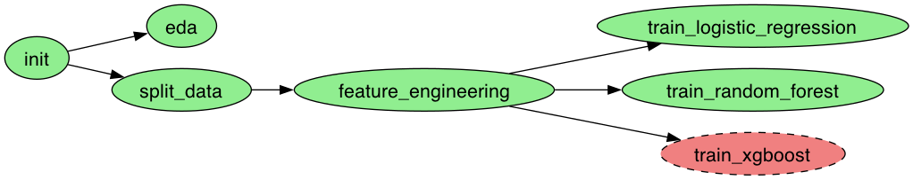

# Fraud transactions detection task

## Objective

### Context: card skimming

Card fraud is a type of financial crime where someone uses another person's payment card information,
such as credit or debit card details, to make unauthorized transactions.

Criminals use a device called a skimmer to steal credit or debit card information from
individuals.

Skimmers are small electronic devices that are often placed on top of or inside card readers, 
such as those found at ATMs, gas pumps, or point-of-sale terminals at stores or restaurants.

When a person swipes or inserts their card into the
compromised reader, the skimmer captures the card's data, 
including the account number and security code.

This information can then be used to create a counterfeit
card or make unauthorized purchases.

### Dataset 

The provided data is a synthetic dataset created specifically for this skill test.

The data comes from physical card transactions from a fake bank called Bank. 
The customers of this bank, in a similar fashion to the customers of Our Service, are professional businesses.

These businesses operate in a defined economic activity sector, such as restaurants or financial services.
In the dataset, the economic activity is encoded as the sector ID.
Each row represents a transaction a customer is making at a terminal at a point in time.

### Description of fields

| Column          | Description                                                         |
| --------------- | ------------------------------------------------------------------- |
| **TX_DATETIME** | A datetime representing the time the customer made the card payment |
| **CUSTOMER_ID** | An unique identifier of the customer.                               |
| **SECTOR_ID**   | The id of the economic activity sector of the customer.             |
| **TX_AMOUNT**   | The transaction amount.                                             |
| **TX_FRAUD**    | 1 if its fraud, 0 if its not                                        |

### Problem Statement

Until recently, Konto's method of preventing fraud was to wait for clients to call customer
support to report and block their card.

However, manual reviews have become overwhelming for the team.

Consequently, they propose using a predictor to sift through all transactions and identify those with fraudulent behavior.

They have tasked you with creating a predictor to detect fraudulent card transactions.

### Expectations

#### Expected to see

* Jupyter notebooks with appropriate comments / illustrations, used for the
exploratory data analysis and for the modelling phase.
* If you found the time, address the REST API serving your predictor predictions, and payloads to test the API in a Readme file.

## Implementation

### ML Models

For this task, 3 models were evaluated

* [Logistic Regression](https://scikit-learn.org/stable/modules/generated/sklearn.linear_model.LogisticRegression.html)
* [Random Forest](https://scikit-learn.org/stable/modules/generated/sklearn.ensemble.RandomForestClassifier.html)
* [XGBoost](https://xgboost.ai/)

### Notebooks

For the sake of simplicity and reproducibility, each step of data analysis is moved to separate notebook.

Therefore, here is the order of notebooks execution:

1. [Initial notebook](./notebooks/01_init.ipynb)
2. Exploratory Data Analysis
   1. [V1](./notebooks/02_eda_v1.ipynb)
   2. [V2](./notebooks/02_eda_v2.ipynb)
3. [Split data into train / validation / test](./notebooks/03_01_split_data.ipynb)
4. Feature Engineering
   1. [V1](./notebooks/03_02_feature_eng_v1.ipynb)
   2. [V1](./notebooks/03_02_feature_eng_v2.ipynb)
5. Model training
   1. [Linear regression](./notebooks/04_01_model_logreg.ipynb)
   2. [Random Forest](./notebooks/04_02_model_random_forest.ipynb)
   3. [XGBoost](./notebooks/04_03_model_xgboost.ipynb)

**NOTE:**

There are 2 versions for EDA and Feature Engineering steps.

`V1` is relatively old, the most recent one is `v2` 

## Setup

### Notebooks

**NOTE:** Running all notebooks (especially with `ploomber`) might take _a while_ (1 hour+)

There are 3 options of running Jupyter Notebooks within `./notebooks` folder:

#### 1. Manually create Jupyter Kernel

* `make venv-on` - activates Python virtual environment
* `make install-kernel` - creates Python kernel named `ml-tech-assignment` (`ML Tech Assignment` in editor)
* `make set-kernel-in-notebooks` - Updates all Jupyter notebooks under `./notebooks` folder with kernel `ml-tech-assignment`
* Open notebook
* Select Kernel
* Execute cells

#### 2. Run Jupyter lab

* `make jupyter-up` - spin the `Jupyter lab` locally. It is available on http://localhost:8888/

#### 3. Ploomber

* `make ploomber` - it performs:
  * `make venv-on`
  * `make install-kernel`
  * `make set-kernel-in-notebooks`
  * `ploomber build` - runs whole pipeline