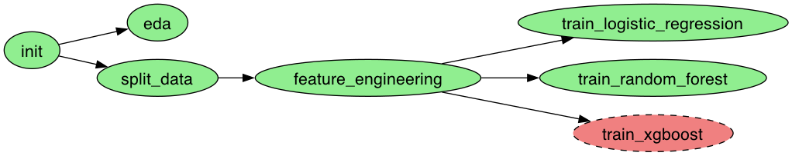

# Fraud Transaction Detection Task

## Objective

### Context: Card Skimming

Card fraud is a type of financial crime in which someone uses another person's payment card information,
such as credit or debit card details, to make unauthorized transactions.

Criminals use a device called a skimmer to steal credit or debit card information from
individuals.

Skimmers are small electronic devices that are often placed on top of or inside card readers,
such as those found at ATMs, gas pumps, or point-of-sale terminals in stores or restaurants.

When a person swipes or inserts their card into a
compromised reader, the skimmer captures the card's data,
including the account number and security code.

This information can then be used to create a counterfeit
card or make unauthorized purchases.

### Dataset

The provided data is a synthetic dataset created specifically for this skill test.

The data comes from physical card transactions from a fictitious bank called Bank.
The customers of this bank, similar to the customers of Our Service, are professional businesses.

These businesses operate in a defined economic activity sector, such as restaurants or financial services.
In the dataset, the economic activity is encoded as the sector ID.
Each row represents a transaction made by a customer at a terminal at a specific point in time.

### Description of Fields

| Column          | Description                                                          |
| --------------- | -------------------------------------------------------------------- |
| **TX_DATETIME** | A datetime representing when the customer made the card payment      |
| **CUSTOMER_ID** | A unique identifier of the customer.                                 |
| **SECTOR_ID**   | The ID of the economic activity sector of the customer.              |
| **TX_AMOUNT**   | The transaction amount.                                              |
| **TX_FRAUD**    | 1 if it is fraud, 0 if it is not                                     |

### Problem Statement

Until recently, Konto's method of preventing fraud was to wait for clients to call customer
support to report and block their card.

However, manual reviews have become overwhelming for the team.

Consequently, they propose using a predictor to sift through all transactions and identify those with fraudulent behavior.

They have tasked you with creating a predictor to detect fraudulent card transactions.

### Expectations

#### Expected Outcomes

* Jupyter notebooks with appropriate comments and illustrations used for
exploratory data analysis and the modeling phase.
* If you have time, address the REST API for serving your predictor’s predictions, and include payloads to test the API in the README file.

## Implementation

### ML Models

For this task, three models were evaluated:

* [Logistic Regression](https://scikit-learn.org/stable/modules/generated/sklearn.linear_model.LogisticRegression.html)
* [Random Forest](https://scikit-learn.org/stable/modules/generated/sklearn.ensemble.RandomForestClassifier.html)
* [XGBoost](https://xgboost.ai/)

### Notebooks

For the sake of simplicity and reproducibility, each step of data analysis is moved to a separate notebook.

Therefore, here is the order of notebook execution:

1. [Initial notebook](./notebooks/01_init.ipynb)
2. Exploratory Data Analysis
   1. [V1](./notebooks/02_eda_v1.ipynb)
   2. [V2](./notebooks/02_eda_v2.ipynb)
3. [Split data into train/validation/test](./notebooks/03_01_split_data.ipynb)
4. Feature Engineering
   1. [V1](./notebooks/03_02_feature_eng_v1.ipynb)
   2. [V2](./notebooks/03_02_feature_eng_v2.ipynb)
5. Model training
   1. [Linear Regression](./notebooks/04_01_model_logreg.ipynb)
   2. [Random Forest](./notebooks/04_02_model_random_forest.ipynb)
   3. [XGBoost](./notebooks/04_03_model_xgboost.ipynb)

**NOTE:**

There are two versions for EDA and Feature Engineering steps.

`V1` is relatively old; the most recent one is `V2`.

## Setup

### Notebooks

**NOTE:** Running all notebooks (especially with `ploomber`) might take _a while_ (1 hour+).

There are three options for running Jupyter Notebooks within the `./notebooks` folder:

#### 1. Manually Create a Jupyter Kernel

* `pip install -e src/fraudlib` — install the internal library with utility functions
* `make venv-on` — activate the Python virtual environment
* `make install-kernel` — create a Python kernel named `ml-tech-assignment` (`ML Tech Assignment` in the editor)
* `make set-kernel-in-notebooks` — update all Jupyter notebooks under the `./notebooks` folder to use the `ml-tech-assignment` kernel
* Open a notebook
* Select the kernel
* Execute cells

#### 2. Run Jupyter Lab

* `make jupyter-up` — spin up Jupyter Lab locally. It is available at http://localhost:8888/

#### 3. Ploomber

* `make ploomber` — this performs:
  * `make venv-on`
  * `make install-kernel`
  * `make set-kernel-in-notebooks`
  * `ploomber build` — runs the whole pipeline