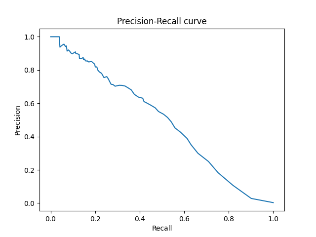
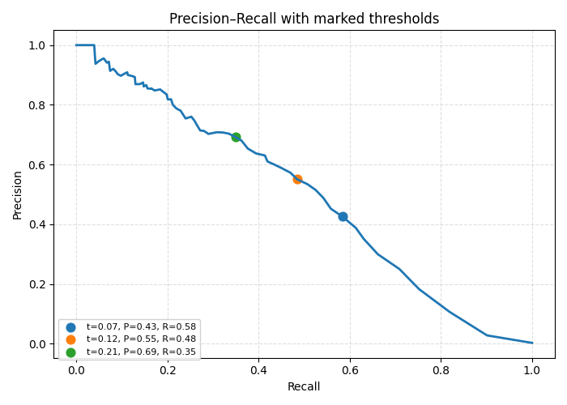
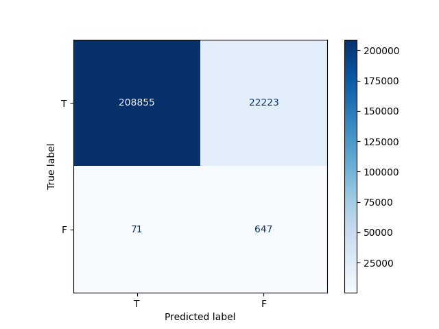
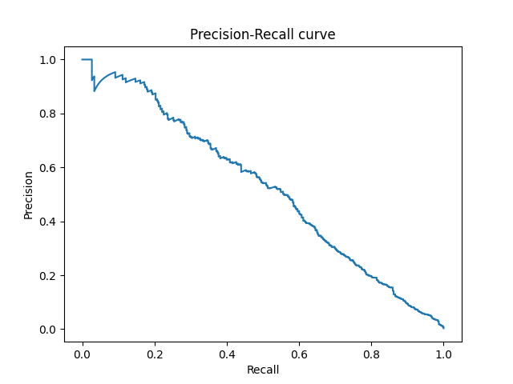
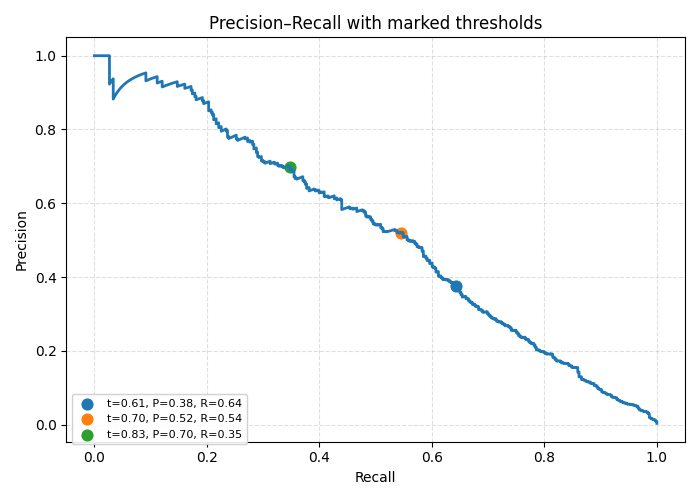
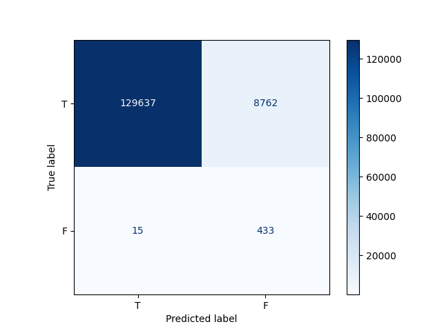
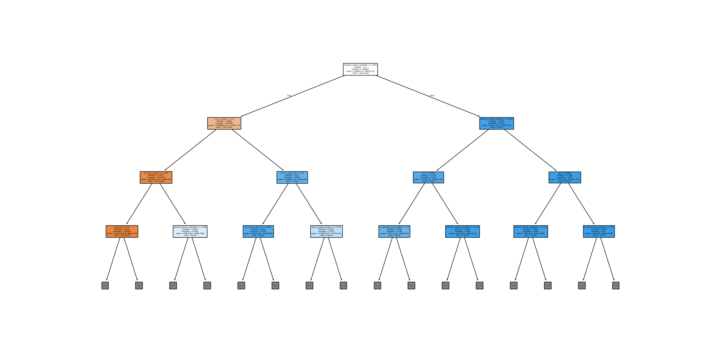
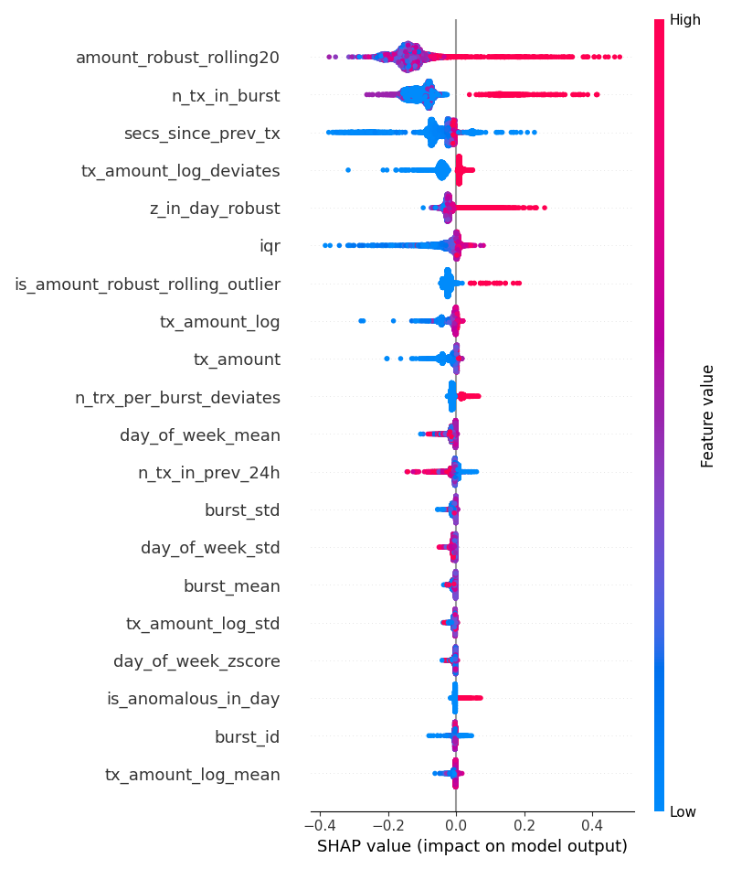

# Random forest

## Precision-recall curve (init)

## Precision-recall curve with thresholds (init)

## Confusion matrix (init)

For the threshold 0.001:
* Precision: 0.028 (Among all of the transactions, `~2.829%` are fraud)
* Recall: 0.901 (Model found `~90.111%` fraud transactions)
* Accuracy: 0.904 (Overall accuracy of the model)
* False blocks of transactions: `~9.617%`
* Missed `~9.889%` of fraud transactions

## Precision-recall curve (best params)

## Precision-recall curve with thresholds (best)

## Confusion matrix (best)

For the threshold 0.1:
* Precision: 0.047 (Among all of the transactions, `~4.709%` are fraud)
* Recall: 0.967 (Model found `~96.652%` fraud transactions)
* Accuracy: 0.937 (Overall accuracy of the model)
* False blocks of transactions: `~6.331%`
* Missed `~3.348%` of fraud transactions

## Sklearn tree

## Snap feature importance

## dtreeviz tree visualization

## dtreeviz tree visualization (vertical)

