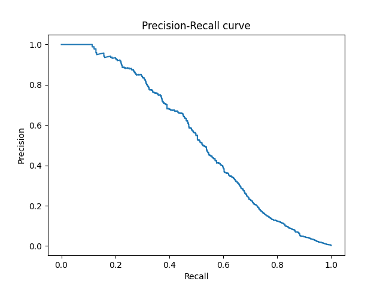
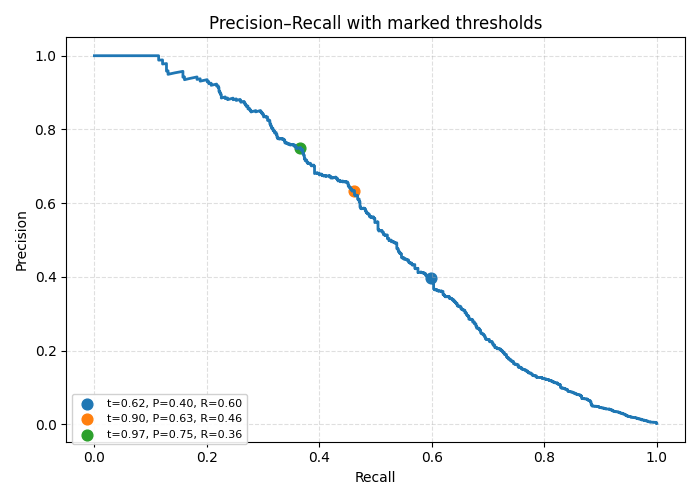
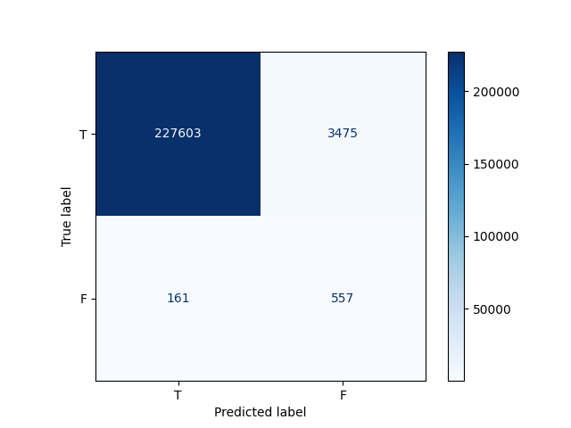
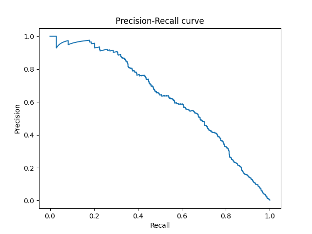
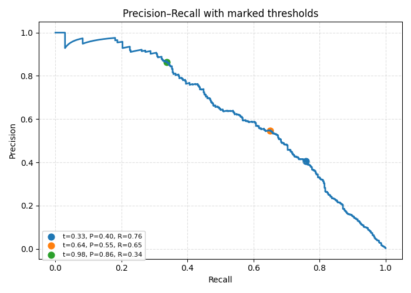
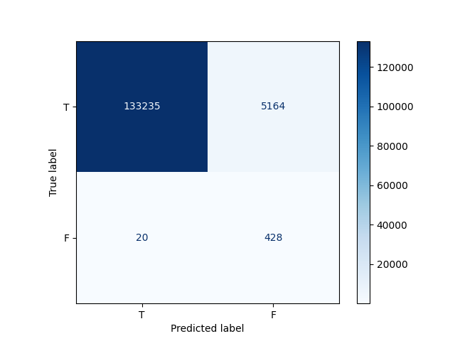
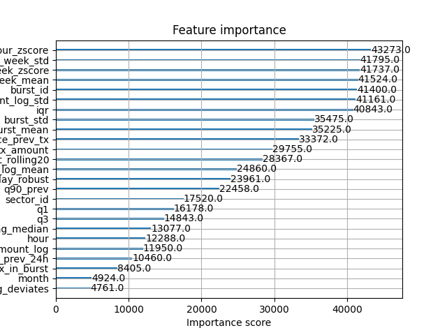

# XGBoost

## Precision-recall curve (init)

## Precision-recall curve with thresholds (init)

## Confusion matrix (init)

For the threshold 0.1:
* Precision: 0.138 (Among all of the transactions, `~13.814%` are fraud)
* Recall: 0.776 (Model found `~77.577%` fraud transactions)
* Accuracy: 0.984 (Overall accuracy of the model)
* False blocks of transactions: `~1.504%`
* Missed `~22.423%` of fraud transactions

## Precision-recall curve (best params)

## Precision-recall curve with thresholds (best)

## Confusion matrix (best)

For the threshold `0.01`:
* Precision: 0.077 (Among all of the transactions, `~7.654%` are fraud)
* Recall: 0.955 (Model found `~95.536%` fraud transactions)
* Accuracy: 0.963 (Overall accuracy of the model)
* False blocks of transactions: `~3.731%`
* Missed `~4.464%` of fraud transactions

## Feature importance

## dtreeviz tree visualization

## dtreeviz tree visualization (vertical)

