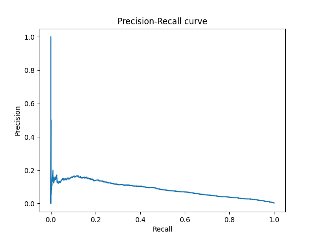
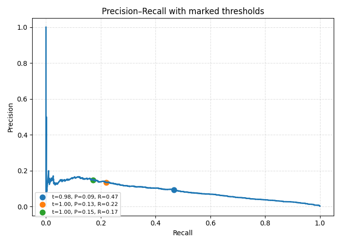
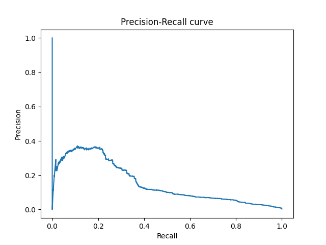
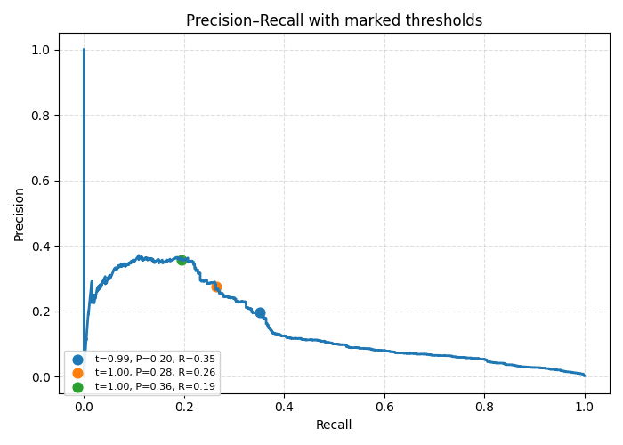
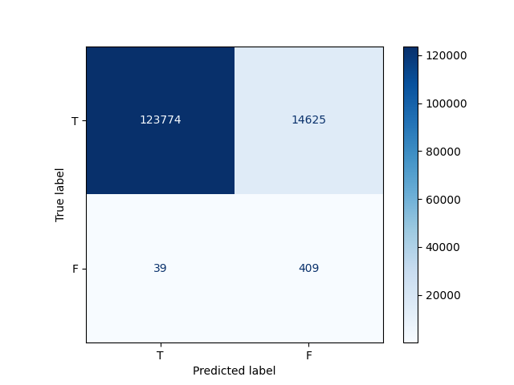

# Logistic Regression

## Precision-recall curve (init)

## Precision-recall curve with thresholds (init)

## Precision-recall curve (best params)

## Precision-recall curve with thresholds (best)

## Confusion matrix

For the threshold 0.79:
* Precision: 0.027 (Among all of the transactions, `~2.721%` are fraud)
* Recall: 0.913 (Model found `~91.295%` fraud transactions)
* Accuracy: 0.894 (Overall accuracy of the model)
* False blocks of transactions: `~10.567%`
* Missed `~8.705%` of fraud transactions

